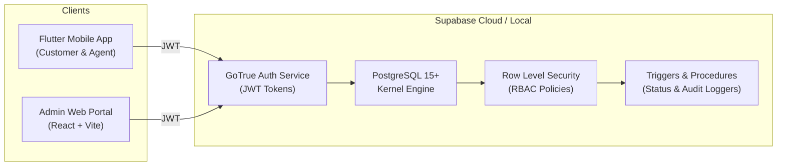

# QuickServe — Service Request Management System

[](https://www.postgresql.org/)
[](https://supabase.com)
[](https://flutter.dev)
[](https://react.dev)
[]()

> Technical Submission for the **Founding Engineering Internship** at **Swasiq** (Health-tech, Nagpur).

QuickServe is an end-to-end, multi-tier Service Request Management System designed to handle home and commercial service dispatches (AC Servicing, Plumbing, Electrical, Cleaning). It couples a **Clean Architecture Flutter mobile application** for Customers and Field Agents with an **Enterprise React 19 Admin Web Portal**, backed by a hardened **Supabase PostgreSQL 15+** database with strict kernel-level Row Level Security (RLS) policies and append-only audit trails.

---

## 1. Overview & Capabilities

QuickServe solves coordination challenges between end-customers, dispatch operations, and mobile field specialists:
- **Customers**: Browse official service offerings, submit structured service tickets with unique sequential identifiers (`REQ-YYYY-XXXXXX`), track real-time resolution progress, and cancel requests prior to technician acceptance.
- **Service Agents**: Access an isolated queue of assigned tickets, accept appointments, provide real-time updates through progressive lifecycle states, and record diagnostic work reports.
- **Administrators**: Operational dashboard with aggregate KPIs, live search and multi-criteria filtering, technician dispatch/assignment tools, and complete visibility over system audit trails.

---

## 2. System Architecture



Full architectural specifications are detailed in [`docs/ARCHITECTURE.md`](docs/ARCHITECTURE.md).

---

## 3. Technology Stack

### Mobile Client (`/flutter_app`)
- **Framework**: Flutter 3.16+ / Dart 3.2+
- **Architecture**: Clean Architecture (Core, Models, Services, Repositories, Providers, Screens, Widgets)
- **State Management**: Riverpod / Provider
- **Storage & Networking**: `supabase_flutter: ^2.5.0`, `flutter_secure_storage: ^9.0.0`
- **UI Components**: Material 3 Design System with custom dark/light branding

### Admin Web Portal (`/src`)
- **Framework**: React 19, TypeScript, Vite
- **Styling**: Tailwind CSS
- **Icons**: Lucide React
- **Animations**: Motion (`motion/react`)
- **Data Layer**: `@supabase/supabase-js: ^2.49.0` with reactive live state & offline-safe fallback

### Backend & Database (`/supabase`)
- **Platform**: Supabase / PostgreSQL 15+
- **Identity & Security**: GoTrue JWT Auth, Row Level Security (RLS), `SECURITY DEFINER` helper routines
- **Triggers**: Automatic sequence generator (`REQ-2026-XXXXXX`), status transition recorder, timestamp managers

---

## 4. User Roles & Access Control (RBAC)

| Capability | Customer | Service Agent | Administrator |
| :--- | :---: | :---: | :---: |
| **Register & Login** | Self-serve | Pre-provisioned | System Admin |
| **Browse Services Catalog** | Yes | Yes | Yes |
| **Create Request** | Yes | No | Yes |
| **View Own Requests** | Yes | Yes (Assigned) | Yes (All) |
| **Cancel Request** | Yes (Pending only) | No | Yes |
| **Accept & Progress Request** | No | Yes (Assigned only) | Yes |
| **Assign Technician** | No | No | Yes |
| **View System Audit Logs** | No | No | Yes |

*Full security rules and threat model available in [`docs/SECURITY.md`](docs/SECURITY.md).*

---

## 5. Service Request Lifecycle

```
CREATED ──► ASSIGNED ──► ACCEPTED ──► IN_PROGRESS ──► COMPLETED
   │            │
   └──► CANCELLED ◄──┘
```

Status modifications are audited in `public.request_status_history` on every transition. Full schema documentation is available in [`docs/DATABASE.md`](docs/DATABASE.md).

---

## 6. Project Structure

```
quickserve/
├── flutter_app/                     # Flutter Mobile Application
│   ├── lib/
│   │   ├── core/                   # Constants, Theme, Routing, Utils, Errors
│   │   ├── models/                  # Domain Models (Request, Profile, Service, etc.)
│   │   ├── services/                # Supabase API & Auth Services
│   │   ├── repositories/            # Data Abstraction Layer
│   │   ├── providers/               # State Management Providers
│   │   ├── screens/                 # Mobile Screens (Auth, Customer, Agent)
│   │   ├── widgets/                 # Reusable UI Widgets
│   │   └── main.dart                # Application Entry Point
│   ├── test/                        # Flutter Unit & Authorization Tests
│   └── pubspec.yaml                 # Dependencies
│
├── supabase/                        # Database Infrastructure
│   ├── migrations/                  # PostgreSQL DDL, RLS, Triggers
│   │   └── 20260922_init_quickserve.sql
│   └── seed.sql                     # Demo Data & Test Accounts
│
├── src/                             # Admin Web Portal & Interactive Simulator
│   ├── components/                  # Admin Dashboard, Request Detail, Modals
│   ├── services/                    # Database, Supabase & Audit Services
│   ├── types.ts                     # Shared TypeScript Data Definitions
│   ├── App.tsx                      # Root Application & Multi-Role Simulator
│   └── main.tsx                     # Web Entry Point
│
├── docs/                            # Engineering Documentation
│   ├── ARCHITECTURE.md              # System Architecture & Mermaid Diagrams
│   ├── SECURITY.md                  # RLS Policies, Threat Model, IDOR Protection
│   ├── DATABASE.md                  # Table Specs, ER Diagrams, Indexing
│   ├── SETUP.md                     # Local & Production Setup Instructions
│   └── INTERVIEW_PREP.md            # 18 Technical Interview Questions & Answers
│
├── .env.example                     # Environment Configuration Template
├── package.json                     # Web Node Dependencies
└── README.md                        # Master Project Documentation
```

---

## 7. Quick Start & Local Setup

### Step 1: Clone & Configure
```bash
git clone https://github.com/your-username/quickserve.git
cd quickserve
cp .env.example .env
```

### Step 2: Provision Database
Execute `supabase/migrations/20260922_init_quickserve.sql` and `supabase/seed.sql` inside your Supabase project's SQL Editor.

### Step 3: Launch Admin Web Portal & Interactive Simulator
```bash
npm install
npm run dev
# Running on http://localhost:3000
```

### Step 4: Launch Flutter Mobile Client
```bash
cd flutter_app
flutter pub get
flutter run -d chrome # or -d android
```

---

## 8. Test Accounts

| Role | Email | Password | Details |
| :--- | :--- | :--- | :--- |
| **Admin** | `admin@quickserve.com` | `AdminPass123!` | Alex Rivera — Operations Lead |
| **Agent** | `agent@quickserve.com` | `AgentPass123!` | Marcus Vance — Senior HVAC & Electrical |
| **Agent** | `agent2@quickserve.com` | `AgentPass123!` | Priya Sharma — Master Plumber |
| **Customer** | `customer@quickserve.com` | `CustomerPass123!` | Sarah Jenkins (Active Requests) |
| **Customer** | `customer2@quickserve.com` | `CustomerPass123!` | David Chen (Active Requests) |

---

## 9. Interview Review Preparation

For detailed answers to the 18 key technical questions (Supabase vs Firebase, RLS deep dive, IDOR prevention, concurrency control, scale-to-millions strategy), see [`docs/INTERVIEW_PREP.md`](docs/INTERVIEW_PREP.md).
