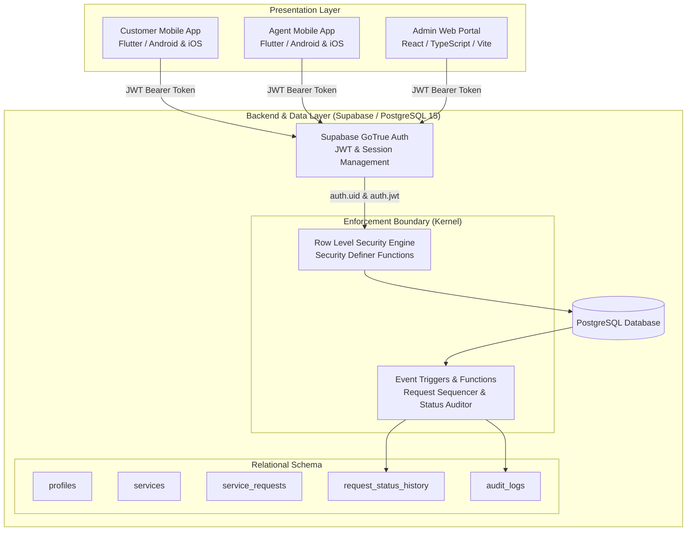
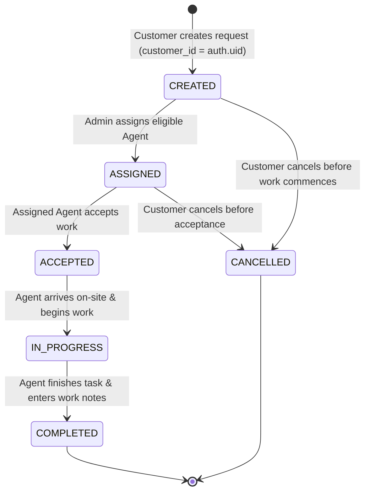
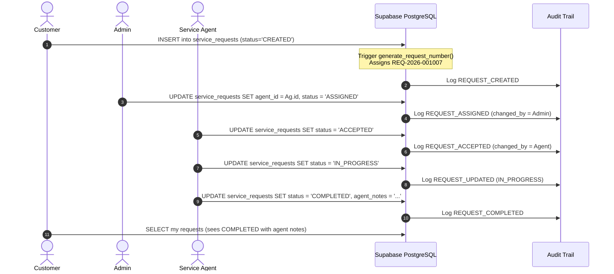

# QuickServe Architecture Documentation

## 1. System Overview

QuickServe is an end-to-end Service Request Management System engineered for operational efficiency, absolute data isolation, and auditability. It bridges customers, on-ground service agents, and business administrators across two client tiers connected to a managed Supabase (PostgreSQL 15+) cloud backend.

---

## 2. Architectural Layers

### A. Presentation Layer
1. **Flutter Mobile Application (`flutter_app/`)**:
   - Built with **Clean Architecture**: separation of `core`, `models`, `services`, `repositories`, `providers`, and `screens`.
   - Dual interface modes (Customer View & Service Agent View) driven by authenticated user role.
   - Dynamic request number formatting (`REQ-YYYY-XXXXXX`).
   - Optimistic status transitions with local validation before remote dispatch.
2. **Admin Web Management Portal (`src/`)**:
   - Single-Page Application (SPA) built using React 19, TypeScript, Vite, and Tailwind CSS.
   - Operational dashboard with status aggregates (Total, Created, Assigned, Accepted, In Progress, Completed, Cancelled).
   - Real-time agent dispatch & assignment interface.
   - System Audit Trail inspector and RBAC permission verification suite.

### B. Security & Identity Layer
1. **Supabase Auth (GoTrue)**:
   - Issues signed, asymmetric JWT tokens containing user claims (`sub`, `email`, `role`).
   - Client session storage persists tokens securely (Flutter `flutter_secure_storage` / Web `localStorage`).
2. **Row Level Security (RLS)**:
   - Database-level policies evaluate `auth.uid()` against table foreign keys on every query.
   - Zero-trust model: Frontend UI checks exist purely for UX convenience; raw API requests cannot bypass RLS.

### C. Data & State Management Layer
1. **PostgreSQL Relational Storage**:
   - Strictly typed schemas with PostgreSQL `ENUM`s (`user_role`, `request_priority`, `request_status`, `audit_action_type`).
   - Referential integrity constraints (`ON DELETE RESTRICT` for active requests).
   - Atomic stored procedures and triggers for audit logging and sequence generation.

---

## 3. Core Data Flow & Request Lifecycle

### State Machine Transition Rules:
| Current Status | Permitted Next Status | Authorized Role | Preconditions |
| :--- | :--- | :--- | :--- |
| `CREATED` | `ASSIGNED` | Administrator | Agent must be selected (`agent_id IS NOT NULL`) |
| `CREATED` | `CANCELLED` | Customer, Admin | Valid cancellation note provided |
| `ASSIGNED` | `ACCEPTED` | Assigned Agent | Agent must match `agent_id = auth.uid()` |
| `ASSIGNED` | `CANCELLED` | Customer, Admin | Prior to on-site work |
| `ACCEPTED` | `IN_PROGRESS` | Assigned Agent | Agent begins service execution |
| `IN_PROGRESS` | `COMPLETED` | Assigned Agent | Completion notes / diagnostic report entered |

---

## 4. Role-Based Access Control (RBAC) Matrix

| Operational Capability | Customer | Service Agent | Administrator |
| :--- | :---: | :---: | :---: |
| **Register Account** | Yes | Admin Provisioned | System Provisioned |
| **Browse Services Catalog** | Yes | Yes | Yes |
| **Create Service Request** | Yes (Own) | No | Yes (Any Customer) |
| **View Service Request** | Only Own | Only Assigned | All Requests |
| **Cancel Service Request** | Yes (if CREATED/ASSIGNED) | No | Yes |
| **Accept Service Request** | No | Yes (Only Assigned) | Yes |
| **Transition to In Progress** | No | Yes (Only Assigned) | Yes |
| **Complete Service Request** | No | Yes (Only Assigned) | Yes |
| **Assign / Reassign Agent** | No | No | Yes |
| **Inspect System Audit Logs** | No | No | Yes |
| **Access Other User Profiles**| Blocked by RLS | Blocked by RLS | Yes |

---

## 5. Sequence Diagram: Service Creation to Completion

